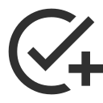
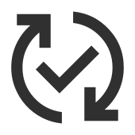
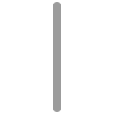
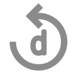
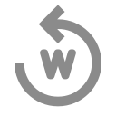
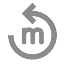

# License
The icons (except `vertical_bar`) are made by [Google](https://fonts.google.com) and licensed under the [Apache 2.0](https://www.apache.org/licenses/LICENSE-2.0.html) license. 
The repeat icons are a merge of the `replay` icon and letters from the Roboto font, the Inkscape SVG file is included in
the `resources/icons/checkbox` folder. All other icons are unmodified (except for the coloring).


# Colors
If you want to recreate the icons, those are the colors used:
```
Red:    ec2d2dff
Green:  419d34ff
Grey:   303030ff
L-Grey: 8b8b8bff
```

# Icons

The icons can be found in `resources/icons/checkbox`. The variables can be changed in `accounting_bot/ext/checklist.py`
if you want to use other emojis.

| Name                     | Discord Emoji                 | Variable               | Image                                                                        |
|--------------------------|-------------------------------|------------------------|------------------------------------------------------------------------------|
| `add_task_grey`          | `<:a_t:1152242628889432204>`  | `EMOJI_ADD_TASK`       |           |
| `refresh_check_grey`     | `<:r_c:1152242680873627779>`  | `EMOJI_REFRESH`        |      |
| `blank_checkbox_red`     | `<:c_g:1152242630239997972>`  | `EMOJI_UNCHECKED`      |      |
| `checked_checkbox_green` | `<:c_r:1152242632358101112>`  | `EMOJI_CHECKED`        |  |
| `vertical_bar`           | `<:vb:1152233072209690684>`   | `EMOJI_VERT_BAR`       |            |
| `repeat_d`               | `<:rp_d:1152298830033850368>` | `EMOJI_REPEAT_DAILY`   |                    |
| `repeat_w`               | `<:rp_w:1152299344326840430>` | `EMOJI_REPEAT_WEEKLY`  |                    |
| `repeat_m`               | `<:rp_m:1152299341969633410>` | `EMOJI_REPEAT_MONTHLY` |                    |

